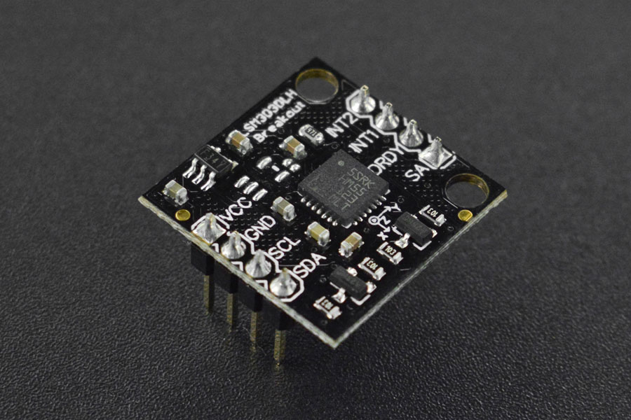

# DFRobot_LSM303
- [中文版](./README_CN.md)

The LSM303DLH is a triple axis accelerometer combined with a triple axis magnetic sensor. <br>
This breakout board uses the LSM303DLH to give you the data you need to feed into a <br>
microcontroller and calculate tilt-compensated output.<br>



## Product Link（https://www.dfrobot.com/product-640.html)    
   SEN0079：Fermion: LSM303 Tilt Compensated Compass (Breakout)
## Table of Contents

* [Summary](#summary)
* [Installation](#installation)
* [Methods](#methods)
* [Compatibility](#compatibility)
* [History](#history)
* [Credits](#credits)

## Summary
Provide an Arduino library to get the acceleration in three directions
## Installation

To use this library, first download the library file, paste it into the \Arduino\libraries directory, then open the examples folder and run the demo in the folder.


## Methods
```C++

  /*!
   * @fn DFRobot_EC10
   * @brief Constructor 
   */
  DFRobot_LSM303(void);
  
  /*!
   * @fn init
   * @brief initializes the library with the device being used (device_DLH, device_DLM,
   * @n      device_DLHC, device_D, or device_auto) and the state of the SA0 pin (sa0_low, 
   * @n      sa0_high, or sa0_auto), which determines the least significant bit(s) of the 
   * @n      I²C slave address (on some devices, and only for the accelerometer in some cases). 
   * @n      Constants for these arguments are defined in LSM303.h. Both of these arguments are 
   * @n      optional; if they are not specified, the library will try to automatically detect 
   * @n      the device and accelerometer address1. A boolean is returned indicating whether the 
   * @n      type of LSM303 device was successfully determined (if necessary)
   * @param device  eDeviceType_t
   * @param sa0_auto eSa0State_t
   * @return 0 success
   */
  bool init(eDeviceType_t device = device_auto, eSa0State_t sa0 = sa0_auto);
  
  /*!
   * @fn enable
   * @brief Turns on the accelerometer and magnetometer and enables a consistent set of default settings.
   * @n      This function will set the accelerometer’s full scale to be +/-2 g, which means that a reading 
   * @n      of 16384 corresponds to approximately 1 g. The magnetometer’s full scale is set to +/-4 gauss
   * @n      for the LSM303D or +/-1.3 gauss on all other devices. See the comments in LSM303.cpp for a 
   * @n      full explanation of these settings.
   */
  void enable(void);

  /*!
   * @fn read
   * @brief Takes a reading from both the accelerometer and magnetometer and stores the values in the vectors a and m
   */
  void read(void);
  
  /*!
   * @fn setTimeout
   * @brief Sets a timeout period for readAcc() and readMag(), in milliseconds, 
   * @n       after which they will abort if no data is received. A value of 0 disables the timeout
   */
  void setTimeout(unsigned int timeout);
  
  /*!
   * @fn getTimeout
   * @brief Get the current timeout period setting
   * @return the current timeout period setting
   */
  unsigned int getTimeout(void);
  
  /*!
   * @fn timeoutOccurred
   * @brief Get a boolean indicating whether a call to readAcc() or readMag() has timed 
   * @n     out since the last call to timeoutOccurred()
   * @return boolean true/false
   */
  bool timeoutOccurred(void);
  
  /*!
   * @fn getNavigationAngle
   * @brief Get the tilt-compensated heading of a default vector in degrees 
   * @n     (the angular difference in the horizontal plane between the default vector and north).
   * @n      The default vector is chosen to point along the surface of the PCB, in the direction 
   * @n      of the top of the text on the silkscreen. This is the +X axis on the Pololu LSM303D 
   * @n      carrier and the -Y axis on the Pololu LSM303DLHC, LSM303DLM, and LSM303DLH carriers.
   * @return the value of drift angle.
   */
  float getNavigationAngle(void);
```

## Compatibility

MCU                | Work Well    | Work Wrong   | Untested    | Remarks
------------------ | :----------: | :----------: | :---------: | -----
Arduino Uno        |      √       |              |             | 
FireBeetle-ESP8266        |      √       |              |             | 
FireBeetle-ESP32        |      √       |              |             | 
Arduino MEGA2560        |      √       |              |             | 
Arduino Leonardo|      √       |              |             | 
Micro:bit        |      √       |              |             | 
FireBeetle-M0        |      √       |              |             | 
Raspberry Pi      |      √       |              |             | 


## History

- 2022/05/07 - Version 1.0.0 released.
## Credits

Written by fengli(li.feng@dfrobot.com), 2022.05.07 (Welcome to our [website](https://www.dfrobot.com/))


