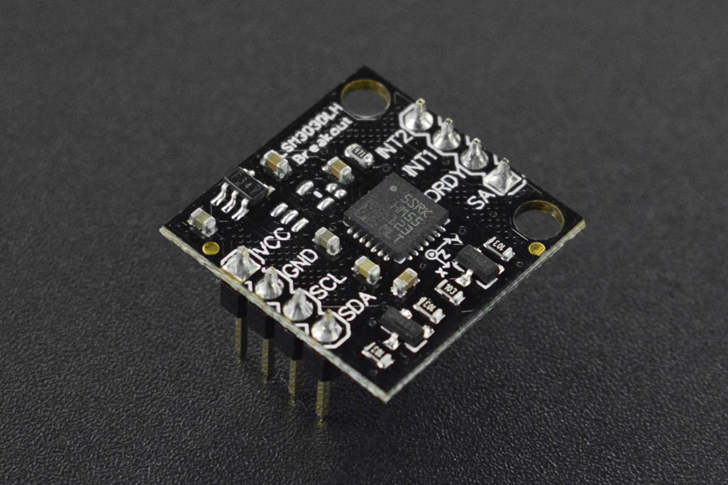

# DFRobot_LSM303
- [English Version](./README.md)

该传感器采用了LSM303DLH芯片。集成了3轴磁场，3轴加速度传感器，可以提供倾斜补偿后的输出。可以说是目前市场上最具性价比的电子罗盘传感器。这样只用一颗芯片就实现了6轴的数据检测和输出，降低了客户的设计难度，减小了PCB板的占用面积，降低了器件成本。微型的体积足以让它集成在任何项目之上。<br>



## 产品链接（https://www.dfrobot.com.cn/goods-326.html)
    SEN0079：6轴电子罗盘LSM303DLH（带倾斜补偿）
## 目录

  * [概述](#概述)
  * [库安装](#库安装)
  * [方法](#方法)
  * [兼容性](#兼容性)
  * [历史](#历史)
  * [创作者](#创作者)

## 概述

提供Arduino库获取三个方向的加速度

## 库安装

使用此库前，请首先下载库文件，将其粘贴到\Arduino\libraries目录中，然后打开examples文件夹并在该文件夹中运行演示。

## 方法
```C++

  /*!
   * @fn init
   * @brief 初始化设备用的库(device_DLH, device_DLM,device_DLHC, device_D, or device_auto)
   * @n 和引脚SA0的状态(sa0_low,sa0_high,sa0_auto)，这决定(某些设备，某些情况下只适用于加速度计)I2C地址的最低有效位。
   * @n 上面的参数常量定义在 DFRobot_LSM303.h文件中，这两个参数都是可选的，如果没有指定，库将尝试自动检测设备和加速计address1。（必要的话）返回一个布尔值，表明是否成功确定LSM303设备的类型
   * @param device  eDeviceType_t
   * @param sa0_auto eSa0State_t
   * @return 0 成功
   */
  bool init(eDeviceType_t device = device_auto, eSa0State_t sa0 = sa0_auto);
  
  /*!
   * @fn enable
   * @brief 打开加速计和磁力计，并启用一致的默认设置。
   * @n      这个函数设置加速度计的满量程至+/-2g，表示16384的读数相当于1g。 
   * @n      设置LSM303D磁力计的满量程为+/-4高斯，
   * @n      其他设备上设置为+/-1.3高斯。
   * @n      关于这些设置的完整解释，请参见LSM303.cpp的注释。
   */
  void enable(void);

  /*!
   * @fn read
   * @brief 从加速度计和磁力计中获取读数，并将该值存储在向量a和m中。
   */
  void read(void);
  
  /*!
   * @fn setTimeout
   * @brief 为readAcc()和readMag()设置一个超时检测，单位为ms，当在timeout(ms)时间后没有数据返回函数将终止。值为0时禁用超时。
   */
  void setTimeout(unsigned int timeout);
  
  /*!
   * @fn getTimeout
   * @brief 获取当前设置的超时检测时间
   * @return 超时时间(ms)
   */
  unsigned int getTimeout(void);
  
  /*!
   * @fn timeoutOccurred
   * @brief 获取一个bool值，表示自上次调用timeoutOccurred()后， 
   * @n     对readAcc()或readMag()的调用是否已经超时了。
   * @return boolean true/false
   */
  bool timeoutOccurred(void);
  
  /*!
   * @fn getNavigationAngle
   * @brief 获取默认矢量的倾斜补偿方向，单位为度（默认矢量与北在水平面上的角度差）。选择默认向量指向沿着PCB表面，即丝印上的文本顶部的方向。
   * @n 这是Pololu LSM303D载体上的+X轴，以及Pololu LSM303DLHC、LSM303DLM和LSM303DLH载体上的-Y轴。
   * @return 返回漂移角的值。
   */
  float getNavigationAngle(void);
```

## 兼容性

主板                | 通过    | 未通过   | 未测试    | 备注
------------------ | :----------: | :----------: | :---------: | -----
Arduino Uno        |      √       |              |             | 
FireBeetle-ESP8266        |      √       |              |             | 
FireBeetle-ESP32        |      √       |              |             | 
Arduino MEGA2560        |      √       |              |             | 
Arduino Leonardo|      √       |              |             | 
Micro:bit        |      √       |              |             | 
FireBeetle-M0        |      √       |              |             | 
Raspberry Pi      |      √       |              |             | 


## 历史

- 2022/05/07 - 版本 1.0.0 发布.

## 创作者

Written by fengli(li.feng@dfrobot.com), 2022.05.07 (Welcome to our [website](https://www.dfrobot.com/))


